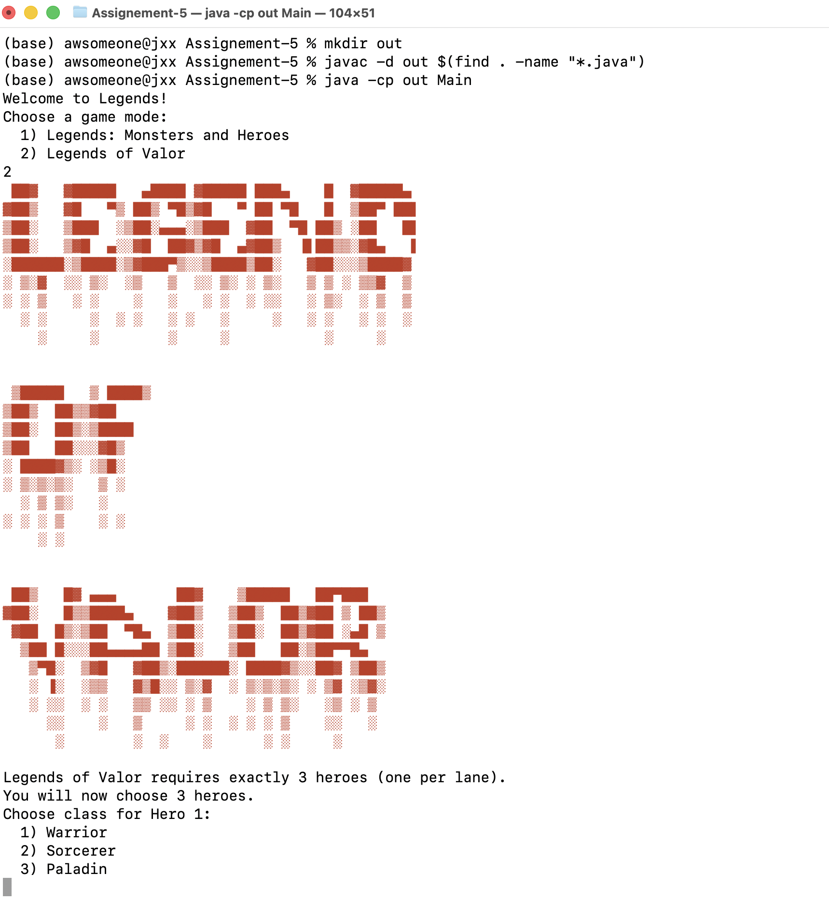
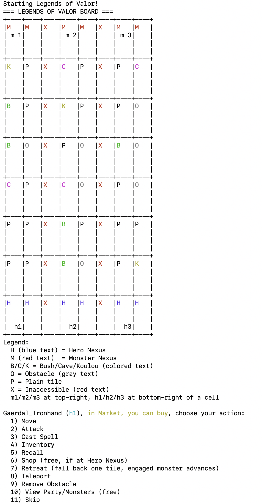

# CS611_Final Project

## Legend of Valor

---

- Name: Chunyu Wu
- Email: tony56cx@bu.edu
- Student ID: U39064594
- Name: Hoang Nguyen
- Email: hnguy@bu.edu
- Student ID: U36068287
- Name: Xiaoxi Jiang
- Email: xiaoxij@bu.edu
- Student ID: U32683512

## File Structure

---

```
Assignement-5/
│
├── Main.java → Program entry; lets player pick game mode, builds party/world, runs engine
├── Legends_Monsters_and_Heroes/ → Text data for heroes/monsters/items and ASCII banner
│
├── core/
│ ├── GameEngine.java → Classic loop: exploration → events/market/inventory → random battle
│ ├── ValorGameEngine.java → Valor mode runner wiring phases and context
│ ├── AbstractEngineBase.java → Shared factories/market/RNG wiring
│ ├── Direction.java/Position.java/GameState.java → Movement, coordinates, classic state enum
│ └── valor/
│ ├── ValorContext.java → Central game state (world, positions, codes, factories, logs, wave period)
│ ├── ValorGameLoop.java → Runs setup → hero → monster → cleanup → end-round until game over
│ ├── ValorSupport.java → Helpers for setup, lane levels, markets, inventory/recall/teleport/obstacle, respawn/regen/spawns, logging
│ ├── phases/Phase.java → Phase interface; SetupPhase/HeroPhase/MonsterPhase/CleanupPhase/EndOfRoundPhase run each step
│ └── services/ → HeroTurnController, movement/combat/inventory/market/terrain services, ValorRules (pure checks), MonsterSystem (AI)
│
├── battle/
│ ├── StandardBattle.java → Classic turn-based battle loop with rewards
│ ├── HeroAction.java / AttackAction.java / CastSpellAction.java / SkipAction.java → Hero actions in classic battles
│ └── Battle.java → Battle interface
│
├── characters/
│ ├── Character.java / AbstractCharacter.java → Base HP/level contract and implementation
│ ├── Hero.java → Stats, leveling, gear, dodge, inventory, attacks
│ ├── Monster.java → Stats, defense/dodge handling, spell damage handling
│ └── HeroType.java → Hero class enum
│
├── data/
│ ├── HeroFactory.java → Load heroes from text files
│ ├── MonsterFactory.java → Load monster templates and spawn scaled monsters
│ └── ItemFactory.java → Load weapons/armor/potions/spells and provide drops/stock
│
├── items/
│ ├── Item/AbstractItem/Equippable/Consumable → Item contracts
│ ├── Weapon.java / Armor.java → Gear definitions
│ ├── Potion.java (+ StatType) → Buff/heal/mana consumables
│ ├── Spell.java (+ SpellType) → Spell damage/effects
│ ├── SpellEffect.java + Fire/Ice/LightningSpellEffect.java → Debuff implementations
│ └── Inventory.java → Simple item list
│
├── world/
│ ├── World.java → Map generation (classic connectivity, Valor lanes), movement, lane helpers
│ ├── Tile.java / AbstractTile.java / TileType.java → Tile abstraction and types
│ ├── CommonTile.java / MarketTile.java / HeroNexusTile.java / MonsterNexusTile.java / ObstacleTile.java / InaccessibleTile.java → Concrete tiles
│ └── (lane helpers inside World for Valor nexus/lanes)
│
├── market/
│ ├── Market.java → Market inventory/restock/buy-sell pricing
│ └── MarketController.java → Interactive shopping UI
│
├── events/
│ ├── EventFactory.java / DefaultEventFactory.java → Event selection for classic exploration
│ ├── GameEvent.java / AbstractGameEvent.java / EventType.java / EventResultType.java → Event contracts
│ ├── EventManager.java → Maybe trigger/resolve events on movement
│ ├── TreasureChestEvent.java → Optional chest, gold reward
│ └── AmbushTrapEvent.java → Trap damage
│
├── io/
│ ├── Renderer.java / ConsoleRenderer.java → Rendering interface; console maps (classic + Valor board)
│ ├── InputHandler.java / ConsoleInputHandler.java → Input interface and console impl
│ └── BannerPrinter.java → Load/print red ASCII banner
│
└── party/
└── PartyBuilder.java → Build party: classic (1–3 heroes) or Valor (exactly 3, lane-assigned)
```

## Note

---

- Visual flair on CLI: colored terrain and IDs on the Valor board, plus a red ASCII banner (only for Valor temporarily) to set the mood before play.
- Rich Valor hero toolkit: move/attack/spell plus recall, retreat with temporary immunity, cross-lane teleport with lane rules, and in-place obstacle removal; markets open only on hero nexus tiles with lane-scaled stock.
- Monster AI that pathfinds within lanes (BFS), respects blockers, sidesteps obstacles, and honors hero immunity/dodge, making positioning matter.
- Dynamic content from data files: heroes/monsters/items/spells are all loaded and scaled at runtime, so balance changes are data-driven, not hardcoded.
- Valor board play: three-lane map with walls, per-lane nexus tiles, terrain buffs (Bush/Cave/Koulou), obstacles you can clear, and hero/monster codes rendered on a zoomed grid.

## How to compile and run

---

1. Create out folder

```bash
mkdir out
```

2. From the project root, compile:

```bash
javac -d out $(find . -name "*.java")
```

3. Run:

```bash
java -cp out Main 
```

## Input/Output Example

---

```bash
(base) awsomeone@jxx Assignement-5 % mkdir out
(base) awsomeone@jxx Assignement-5 % javac -d out $(find . -name "*.java")
(base) awsomeone@jxx Assignement-5 % java -cp out Main
Welcome to Legends!
Choose a game mode:
  1) Legends: Monsters and Heroes
  2) Legends of Valor
```

Choose game "Legends of Valor":

```bash
Welcome to Legends!
Choose a game mode:
  1) Legends: Monsters and Heroes
  2) Legends of Valor
2
 ██▓   ▓█████   ▄████ ▓█████ ███▄    █  ▓█████▄ 
▓██▒   ▓█   ▀▒ ██▒ ▀█▒▓█   ▀ ██ ▀█   █  ▒██▀ ██▌
▒██░   ▒███  ░▒██░▄▄▄░▒███  ▓██  ▀█ ██▒ ░██   █▌
▒██░   ▒▓█  ▄░░▓█  ██▓▒▓█  ▄▓██▒  ▐▌██▒▒░▓█▄   ▌
░██████░▒████░▒▓███▀▒░░▒████▒██░   ▓██░░░▒████▓ 
░ ▒░▓  ░░ ▒░  ░▒   ▒  ░░ ▒░ ░ ▒░   ▒ ▒ ░ ▒▒▓  ▒ 
░ ░ ▒   ░ ░    ░   ░   ░ ░  ░ ░░   ░ ▒░  ░ ▒  ▒ 
  ░ ░     ░  ░ ░   ░ ░   ░     ░   ░ ░   ░ ░  ░ 
    ░     ░        ░     ░           ░     ░    


 ▒█████   ▒ ████▒
▒██▒  ██▒▒▓██    
▒██░  ██▒░▒████  
▒██   ██░░░▓█▒   
░ ████▓▒░ ░▒█░   
░ ▒░▒░▒░   ▒ ░   
  ░ ▒ ▒░   ░     
░ ░ ░ ▒    ░ ░   
    ░ ░          


 ██▒   █▓ ▄▄▄       ██▓    ▒█████   ██▀███  
▓██░   █▒▒████▄    ▓██▒   ▒██▒  ██▒▓██ ▒ ██▒
 ▓██  █▒░▒██  ▀█▄  ▒██░   ▒██░  ██▒▓██ ░▄█ ▒
  ▒██ █░░░██▄▄▄▄██ ▒██░   ▒██   ██░▒██▀▀█▄  
   ▒▀█░  ▒▓█   ▓██▒░██████░ ████▓▒░░██▓ ▒██▒
   ░ ▐░  ░▒▒   ▓▒█░░ ▒░▓  ░ ▒░▒░▒░ ░ ▒▓ ░▒▓░
   ░ ░░  ░ ░   ▒▒ ░░ ░ ▒    ░ ▒ ▒░   ░▒ ░ ▒ 
     ░░    ░   ▒     ░ ░  ░ ░ ░ ▒    ░░   ░ 
      ░        ░  ░    ░      ░ ░     ░     

Legends of Valor requires exactly 3 heroes (one per lane).
You will now choose 3 heroes.
Choose class for Hero 1:
  1) Warrior
  2) Sorcerer
  3) Paladin
```

screen shot:



Choose heroes, assign lanes and choose game difficulty:

```bash
Legends of Valor requires exactly 3 heroes (one per lane).
You will now choose 3 heroes.
Choose class for Hero 1:
  1) Warrior
  2) Sorcerer
  3) Paladin
1
Choose a Warrior for slot 1:
  1) Gaerdal_Ironhand | Lv 1 | MP 100 | STR 750 | DEX 600 | AGI 550 | GOLD 1354
  2) Sehanine_Monnbow | Lv 1 | MP 600 | STR 750 | DEX 500 | AGI 850 | GOLD 2500
  3) Muamman_Duathall | Lv 1 | MP 300 | STR 950 | DEX 750 | AGI 550 | GOLD 2546
  4) Flandal_Steelskin | Lv 1 | MP 200 | STR 800 | DEX 700 | AGI 700 | GOLD 2500
  5) Undefeated_Yoj | Lv 1 | MP 400 | STR 850 | DEX 700 | AGI 450 | GOLD 2500
  6) Eunoia_Cyn | Lv 1 | MP 400 | STR 750 | DEX 600 | AGI 850 | GOLD 2500
1
Do you want to rename this hero? (Y/N)
n
Choose a lane for this hero:
  1) Top lane
  2) Mid lane
  3) Bot lane
1
Choose class for Hero 2:
  1) Warrior
  2) Sorcerer
  3) Paladin
2
Choose a Sorcerer for slot 2:
  1) Rillifane_Rallathil | Lv 1 | MP 1300 | STR 750 | DEX 550 | AGI 500 | GOLD 2500
  2) Segojan_Earthcaller | Lv 1 | MP 900 | STR 800 | DEX 700 | AGI 550 | GOLD 2500
  3) Reign_Havoc | Lv 1 | MP 800 | STR 800 | DEX 850 | AGI 850 | GOLD 2500
  4) Reverie_Ashels | Lv 1 | MP 900 | STR 800 | DEX 450 | AGI 750 | GOLD 2500
  5) Kalabar | Lv 1 | MP 800 | STR 850 | DEX 650 | AGI 450 | GOLD 2500
  6) Skye_Soar | Lv 1 | MP 1000 | STR 700 | DEX 550 | AGI 450 | GOLD 2500
2
Do you want to rename this hero? (Y/N)
n
Choose a lane for this hero:
  1) Top lane
  2) Mid lane
  3) Bot lane
2
Choose class for Hero 3:
  1) Warrior
  2) Sorcerer
  3) Paladin
3
Choose a Paladin for slot 3:
  1) Parzival | Lv 1 | MP 300 | STR 800 | DEX 750 | AGI 650 | GOLD 2500
  2) Sehanine_Moonbow | Lv 1 | MP 300 | STR 800 | DEX 750 | AGI 700 | GOLD 2500
  3) Skoraeus_Stonebones | Lv 1 | MP 250 | STR 700 | DEX 400 | AGI 600 | GOLD 2500
  4) Garl_Glittergold | Lv 1 | MP 100 | STR 650 | DEX 450 | AGI 500 | GOLD 2500
  5) Amaryllis_Astra | Lv 1 | MP 500 | STR 550 | DEX 550 | AGI 500 | GOLD 2500
  6) Caliber_Heist | Lv 1 | MP 400 | STR 450 | DEX 450 | AGI 400 | GOLD 2500
3
Do you want to rename this hero? (Y/N)
n
Choose a lane for this hero:
  1) Top lane
  2) Mid lane
  3) Bot lane
3
Choose difficulty for monster waves:
  1) Easy (wave every 6 rounds)
  2) Normal (wave every 4 rounds)
  3) Hard (wave every 2 rounds)
3
```

Game starts:

```bash
Starting Legends of Valor!
=== LEGENDS OF VALOR BOARD ===
+----+----+----+----+----+----+----+----+
|M   |M   |X   |M   |M   |X   |M   |M   |
| m 1|    |    | m 2|    |    | m 3|    |
|    |    |    |    |    |    |    |    |
|    |    |    |    |    |    |    |    |
+----+----+----+----+----+----+----+----+
|K   |P   |X   |C   |P   |X   |P   |C   |
|    |    |    |    |    |    |    |    |
|    |    |    |    |    |    |    |    |
|    |    |    |    |    |    |    |    |
+----+----+----+----+----+----+----+----+
|B   |P   |X   |K   |P   |X   |P   |O   |
|    |    |    |    |    |    |    |    |
|    |    |    |    |    |    |    |    |
|    |    |    |    |    |    |    |    |
+----+----+----+----+----+----+----+----+
|B   |O   |X   |P   |O   |X   |B   |O   |
|    |    |    |    |    |    |    |    |
|    |    |    |    |    |    |    |    |
|    |    |    |    |    |    |    |    |
+----+----+----+----+----+----+----+----+
|C   |P   |X   |C   |O   |X   |P   |O   |
|    |    |    |    |    |    |    |    |
|    |    |    |    |    |    |    |    |
|    |    |    |    |    |    |    |    |
+----+----+----+----+----+----+----+----+
|P   |P   |X   |B   |P   |X   |P   |P   |
|    |    |    |    |    |    |    |    |
|    |    |    |    |    |    |    |    |
|    |    |    |    |    |    |    |    |
+----+----+----+----+----+----+----+----+
|P   |P   |X   |B   |O   |X   |P   |K   |
|    |    |    |    |    |    |    |    |
|    |    |    |    |    |    |    |    |
|    |    |    |    |    |    |    |    |
+----+----+----+----+----+----+----+----+
|H   |H   |X   |H   |H   |X   |H   |H   |
|    |    |    |    |    |    |    |    |
|    |    |    |    |    |    |    |    |
|  h1|    |    |  h2|    |    |  h3|    |
+----+----+----+----+----+----+----+----+
Legend:
  H (blue text) = Hero Nexus
  M (red text)  = Monster Nexus
  B/C/K = Bush/Cave/Koulou (colored text)
  O = Obstacle (gray text)
  P = Plain tile
  X = Inaccessible (red text)
  m1/m2/m3 at top-right, h1/h2/h3 at bottom-right of a cell

Gaerdal_Ironhand (h1), in Market, you can buy, choose your action:
  1) Move
  2) Attack
  3) Cast Spell
  4) Inventory
  5) Recall
  6) Shop (free, if at Hero Nexus)
  7) Retreat (fall back one tile, engaged monster advances)
  8) Teleport
  9) Remove Obstacle
  10) View Party/Monsters (free)
  11) Skip
```

Screen shot:



Play for 1 round:

```bash
=== LEGENDS OF VALOR BOARD ===
+----+----+----+----+----+----+----+----+
|M   |M   |X   |M   |M   |X   |M   |M   |
|    |    |    |    |    |    |    |    |
|    |    |    |    |    |    |    |    |
|    |    |    |    |    |    |    |    |
+----+----+----+----+----+----+----+----+
|K   |P   |X   |C   |P   |X   |P   |C   |
| m 4|    |    | m 5|    |    | m 6|    |
|    |    |    |    |    |    |    |    |
|    |    |    |    |    |    |    |    |
+----+----+----+----+----+----+----+----+
|B   |P   |X   |K   |P   |X   |P   |O   |
|    |    |    |    |    |    |    |    |
|    |    |    |    |    |    |    |    |
|    |    |    |    |    |    |    |    |
+----+----+----+----+----+----+----+----+
|B   |O   |X   |P   |O   |X   |B   |O   |
| m 1|    |    | m 2|    |    | m 3|    |
|    |    |    |    |    |    |    |    |
|    |    |    |    |    |    |    |    |
+----+----+----+----+----+----+----+----+
|C   |P   |X   |C   |O   |X   |P   |O   |
|    |    |    |    |    |    |    |    |
|    |    |    |    |    |    |    |    |
|  h1|    |    |    |    |    |    |    |
+----+----+----+----+----+----+----+----+
|P   |P   |X   |B   |P   |X   |P   |P   |
|    |    |    |    |    |    |    |    |
|    |    |    |    |    |    |    |    |
|    |    |    |    |  h2|    |  h3|    |
+----+----+----+----+----+----+----+----+
|P   |P   |X   |B   |O   |X   |P   |K   |
|    |    |    |    |    |    |    |    |
|    |    |    |    |    |    |    |    |
|    |    |    |    |    |    |    |    |
+----+----+----+----+----+----+----+----+
|H   |H   |X   |H   |H   |X   |H   |H   |
|    |    |    |    |    |    |    |    |
|    |    |    |    |    |    |    |    |
|    |    |    |    |    |    |    |    |
+----+----+----+----+----+----+----+----+
Legend:
  H (blue text) = Hero Nexus
  M (red text)  = Monster Nexus
  B/C/K = Bush/Cave/Koulou (colored text)
  O = Obstacle (gray text)
  P = Plain tile
  X = Inaccessible (red text)
  m1/m2/m3 at top-right, h1/h2/h3 at bottom-right of a cell

Gaerdal_Ironhand (h1), in Cave, agility increased, choose your action:
  1) Move
  2) Attack
  3) Cast Spell
  4) Inventory
  5) Recall
  6) Shop (free, if at Hero Nexus)
  7) Retreat (fall back one tile, engaged monster advances)
  8) Teleport
  9) Remove Obstacle
  10) View Party/Monsters (free)
  11) Skip
2
Choose a monster to attack:
  1) Natsunomeryu (Lv 1, HP 150/150)
  0) Back
1
Gaerdal_Ironhand attacked Natsunomeryu for 150 damage.
Natsunomeryu has been defeated!
Gaerdal_Ironhand gains 2 XP and 500 gold.
=== LEGENDS OF VALOR BOARD ===
+----+----+----+----+----+----+----+----+
|M   |M   |X   |M   |M   |X   |M   |M   |
|    |    |    |    |    |    |    |    |
|    |    |    |    |    |    |    |    |
|    |    |    |    |    |    |    |    |
+----+----+----+----+----+----+----+----+
|K   |P   |X   |C   |P   |X   |P   |C   |
| m 4|    |    | m 5|    |    | m 6|    |
|    |    |    |    |    |    |    |    |
|    |    |    |    |    |    |    |    |
+----+----+----+----+----+----+----+----+
|B   |P   |X   |K   |P   |X   |P   |O   |
|    |    |    |    |    |    |    |    |
|    |    |    |    |    |    |    |    |
|    |    |    |    |    |    |    |    |
+----+----+----+----+----+----+----+----+
|B   |O   |X   |P   |O   |X   |B   |O   |
| m 1|    |    | m 2|    |    | m 3|    |
|    |    |    |    |    |    |    |    |
|    |    |    |    |    |    |    |    |
+----+----+----+----+----+----+----+----+
|C   |P   |X   |C   |O   |X   |P   |O   |
|    |    |    |    |    |    |    |    |
|    |    |    |    |    |    |    |    |
|  h1|    |    |    |    |    |    |    |
+----+----+----+----+----+----+----+----+
|P   |P   |X   |B   |P   |X   |P   |P   |
|    |    |    |    |    |    |    |    |
|    |    |    |    |    |    |    |    |
|    |    |    |    |  h2|    |  h3|    |
+----+----+----+----+----+----+----+----+
|P   |P   |X   |B   |O   |X   |P   |K   |
|    |    |    |    |    |    |    |    |
|    |    |    |    |    |    |    |    |
|    |    |    |    |    |    |    |    |
+----+----+----+----+----+----+----+----+
|H   |H   |X   |H   |H   |X   |H   |H   |
|    |    |    |    |    |    |    |    |
|    |    |    |    |    |    |    |    |
|    |    |    |    |    |    |    |    |
+----+----+----+----+----+----+----+----+
Legend:
  H (blue text) = Hero Nexus
  M (red text)  = Monster Nexus
  B/C/K = Bush/Cave/Koulou (colored text)
  O = Obstacle (gray text)
  P = Plain tile
  X = Inaccessible (red text)
  m1/m2/m3 at top-right, h1/h2/h3 at bottom-right of a cell

Segojan_Earthcaller (h2), choose your action:
  1) Move
  2) Attack
  3) Cast Spell
  4) Inventory
  5) Recall
  6) Shop (free, if at Hero Nexus)
  7) Retreat (fall back one tile, engaged monster advances)
  8) Teleport
  9) Remove Obstacle
  10) View Party/Monsters (free)
  11) Skip
9
Segojan_Earthcaller cleared the obstacle ahead.
=== LEGENDS OF VALOR BOARD ===
+----+----+----+----+----+----+----+----+
|M   |M   |X   |M   |M   |X   |M   |M   |
|    |    |    |    |    |    |    |    |
|    |    |    |    |    |    |    |    |
|    |    |    |    |    |    |    |    |
+----+----+----+----+----+----+----+----+
|K   |P   |X   |C   |P   |X   |P   |C   |
| m 4|    |    | m 5|    |    | m 6|    |
|    |    |    |    |    |    |    |    |
|    |    |    |    |    |    |    |    |
+----+----+----+----+----+----+----+----+
|B   |P   |X   |K   |P   |X   |P   |O   |
|    |    |    |    |    |    |    |    |
|    |    |    |    |    |    |    |    |
|    |    |    |    |    |    |    |    |
+----+----+----+----+----+----+----+----+
|B   |O   |X   |P   |O   |X   |B   |O   |
| m 1|    |    | m 2|    |    | m 3|    |
|    |    |    |    |    |    |    |    |
|    |    |    |    |    |    |    |    |
+----+----+----+----+----+----+----+----+
|C   |P   |X   |C   |P   |X   |P   |O   |
|    |    |    |    |    |    |    |    |
|    |    |    |    |    |    |    |    |
|  h1|    |    |    |    |    |    |    |
+----+----+----+----+----+----+----+----+
|P   |P   |X   |B   |P   |X   |P   |P   |
|    |    |    |    |    |    |    |    |
|    |    |    |    |    |    |    |    |
|    |    |    |    |  h2|    |  h3|    |
+----+----+----+----+----+----+----+----+
|P   |P   |X   |B   |O   |X   |P   |K   |
|    |    |    |    |    |    |    |    |
|    |    |    |    |    |    |    |    |
|    |    |    |    |    |    |    |    |
+----+----+----+----+----+----+----+----+
|H   |H   |X   |H   |H   |X   |H   |H   |
|    |    |    |    |    |    |    |    |
|    |    |    |    |    |    |    |    |
|    |    |    |    |    |    |    |    |
+----+----+----+----+----+----+----+----+
Legend:
  H (blue text) = Hero Nexus
  M (red text)  = Monster Nexus
  B/C/K = Bush/Cave/Koulou (colored text)
  O = Obstacle (gray text)
  P = Plain tile
  X = Inaccessible (red text)
  m1/m2/m3 at top-right, h1/h2/h3 at bottom-right of a cell

Skoraeus_Stonebones (h3), choose your action:
  1) Move
  2) Attack
  3) Cast Spell
  4) Inventory
  5) Recall
  6) Shop (free, if at Hero Nexus)
  7) Retreat (fall back one tile, engaged monster advances)
  8) Teleport
  9) Remove Obstacle
  10) View Party/Monsters (free)
  11) Skip

Enter a valid integer: 8
Choose a hero to teleport next to:
  1) Gaerdal_Ironhand @ (4,0)
  2) Segojan_Earthcaller @ (5,4)
  0) Back
2
Choose a teleport destination:
  1) (5,3)
  0) Back
1
Skoraeus_Stonebones teleports to (5, 3)
Natsunomeryu moves to (4, 3).
Andrealphus moves to (4, 6).
Casper moves to (2, 0).
Natsunomeryu moves to (2, 3).
Natsunomeryu moves to (2, 6).
A new wave of monsters appears!
------------------------------------------------------------
Round Info
------------------------------------------------------------
Gaerdal_Ironhand attacked Natsunomeryu for 150 damage.
Natsunomeryu has been defeated.
Gaerdal_Ironhand gains 2 XP and 500 gold.
Segojan_Earthcaller cleared the obstacle at (4, 4).
Skoraeus_Stonebones teleported to (5, 3).
Natsunomeryu moved to (4, 3).
Andrealphus moves to (4, 6).
Casper moves to (2, 0).
Natsunomeryu moves to (2, 3).
Natsunomeryu moves to (2, 6).
A new wave of monsters appeared.
------------------------------------------------------------
```

Game over:

```bash
=== LEGENDS OF VALOR BOARD ===
+----+----+----+----+----+----+----+----+
|M   |M   |X   |M   |M   |X   |M   |M   |
| m 9|    |    | m10|    |    | m11|    |
|    |    |    |    |    |    |    |    |
|    |    |    |    |    |    |    |    |
+----+----+----+----+----+----+----+----+
|K   |P   |X   |C   |P   |X   |P   |C   |
|    |    |    |    |    |    |    |    |
|    |    |    |    |    |    |    |    |
|    |    |    |    |    |    |    |    |
+----+----+----+----+----+----+----+----+
|B   |P   |X   |K   |P   |X   |P   |O   |
| m 6|    |    | m 7|    |    | m 8|    |
|    |    |    |    |    |    |    |    |
|    |    |    |    |    |    |    |    |
+----+----+----+----+----+----+----+----+
|B   |O   |X   |P   |O   |X   |B   |O   |
| m 3|    |    | m 4|    |    |    |    |
|    |    |    |    |    |    |    |    |
|    |    |    |    |    |    |    |    |
+----+----+----+----+----+----+----+----+
|C   |P   |X   |C   |P   |X   |P   |O   |
|    |    |    | m 1|    |    | m 5|    |
|    |    |    |    |    |    |    |    |
|  h1|    |    |    |    |    |    |    |
+----+----+----+----+----+----+----+----+
|P   |P   |X   |B   |P   |X   |P   |P   |
|    |    |    |    |    |    |    |    |
|    |    |    |    |    |    |    |    |
|    |    |    |  h3|  h2|    |    |    |
+----+----+----+----+----+----+----+----+
|P   |P   |X   |B   |O   |X   |P   |K   |
|    |    |    |    |    |    | m 2|    |
|    |    |    |    |    |    |    |    |
|    |    |    |    |    |    |    |    |
+----+----+----+----+----+----+----+----+
|H   |H   |X   |H   |H   |X   |H   |H   |
|    |    |    |    |    |    |    |    |
|    |    |    |    |    |    |    |    |
|    |    |    |    |    |    |    |    |
+----+----+----+----+----+----+----+----+
Legend:
  H (blue text) = Hero Nexus
  M (red text)  = Monster Nexus
  B/C/K = Bush/Cave/Koulou (colored text)
  O = Obstacle (gray text)
  P = Plain tile
  X = Inaccessible (red text)
  m1/m2/m3 at top-right, h1/h2/h3 at bottom-right of a cell

Skoraeus_Stonebones (h3), in Bush, dexterity increased, choose your action:
  1) Move
  2) Attack
  3) Cast Spell
  4) Inventory
  5) Recall
  6) Shop (free, if at Hero Nexus)
  7) Retreat (fall back one tile, engaged monster advances)
  8) Teleport
  9) Remove Obstacle
  10) View Party/Monsters (free)
  11) Skip
11
Skoraeus_Stonebones skips the turn.
Segojan_Earthcaller dodged the attack from Natsunomeryu!
Andrealphus moves to (7, 6).
Gaerdal_Ironhand dodged the attack from Casper!
Natsunomeryu moves to (5, 6).
Andrealphus sidesteps to (2, 1).
Blinky sidesteps to (2, 4).
BigBad-Wolf moves to (3, 6).
Casper moves to (1, 0).
Blinky moves to (1, 3).
Casper moves to (1, 6).
------------------------------------------------------------
Round Info
------------------------------------------------------------
Segojan_Earthcaller dodged the attack from Natsunomeryu.
Andrealphus moves to (7, 6).
Gaerdal_Ironhand dodged the attack from Casper.
Natsunomeryu moves to (5, 6).
Andrealphus sidestepped to (2, 1).
Blinky sidestepped to (2, 4).
BigBad-Wolf moves to (3, 6).
Casper moves to (1, 0).
Blinky moves to (1, 3).
Casper moves to (1, 6).
------------------------------------------------------------
Andrealphus has reached the Hero Nexus! Monsters win!
Game over. Thanks for playing Legends of Valor!
```

Hero win:

```bash
=== LEGENDS OF VALOR BOARD ===
+----+----+----+----+----+----+----+----+
|M   |M   |X   |M   |M   |X   |M   |M   |
|    | m 3|    |    |    |    |    |    |
|    |    |    |    |    |    |    |    |
|    |    |    |    |    |    |    |    |
+----+----+----+----+----+----+----+----+
|P   |K   |X   |O   |K   |X   |P   |K   |
| m 1|    |    |    |    |    |    |    |
|    |    |    |    |    |    |    |    |
|    |    |    |    |    |    |  h3|  h1|
+----+----+----+----+----+----+----+----+
|O   |O   |X   |P   |P   |X   |K   |P   |
|    |    |    |    | m 4|    |    |    |
|    |    |    |    |    |    |    |    |
|    |    |    |    |    |    |    |    |
+----+----+----+----+----+----+----+----+
|P   |C   |X   |O   |B   |X   |P   |C   |
|    |    |    |    |    |    |    |    |
|    |    |    |    |    |    |    |    |
|    |    |    |    |    |    |    |    |
+----+----+----+----+----+----+----+----+
|B   |O   |X   |B   |C   |X   |P   |P   |
|    |    |    |    |    |    |    |    |
|    |    |    |    |    |    |    |    |
|    |    |    |    |    |    |    |    |
+----+----+----+----+----+----+----+----+
|K   |P   |X   |P   |K   |X   |K   |B   |
|    |    |    |    |    |    |    |    |
|    |    |    |    |    |    |    |    |
|    |    |    |  h2|    |    |    |    |
+----+----+----+----+----+----+----+----+
|B   |O   |X   |P   |C   |X   |P   |P   |
|    |    |    |    |    |    |    |    |
|    |    |    |    |    |    |    |    |
|    |    |    |    |    |    |    |    |
+----+----+----+----+----+----+----+----+
|H   |H   |X   |H   |H   |X   |H   |H   |
|    |    |    |    |    |    |    |    |
|    |    |    |    |    |    |    |    |
|    |    |    |    |    |    |    |    |
+----+----+----+----+----+----+----+----+
Legend:
  H (blue text) = Hero Nexus
  M (red text)  = Monster Nexus
  B/C/K = Bush/Cave/Koulou (colored text)
  O = Obstacle (gray text)
  P = Plain tile
  X = Inaccessible (red text)
  m1/m2/m3 at top-right, h1/h2/h3 at bottom-right of a cell

Skoraeus_Stonebones (h3), choose your action:
  1) Move
  2) Attack
  3) Cast Spell
  4) Inventory
  5) Recall
  6) Shop (free, if at Hero Nexus)
  7) Retreat (fall back one tile, engaged monster advances)
  8) Teleport
  9) Remove Obstacle
  10) View Party/Monsters (free)
  11) Skip
1
Use W/A/S/D to move.
Move (W/A/S/D): w
Skoraeus_Stonebones moved to (0, 6).
BigBad-Wolf sidesteps to (1, 1).
BigBad-Wolf sidesteps to (0, 0).
Chrysophylax moves to (3, 4).
------------------------------------------------------------
Round Info
------------------------------------------------------------
Gaerdal_Ironhand moved to (1, 7).
Segojan_Earthcaller moved to (5, 3).
Skoraeus_Stonebones moved to (0, 6).
BigBad-Wolf sidestepped to (1, 1).
BigBad-Wolf sidestepped to (0, 0).
Chrysophylax moved to (3, 4).
------------------------------------------------------------
Skoraeus_Stonebones has reached the Monster Nexus! Heroes win!
Game over. Thanks for playing Legends of Valor!
```


